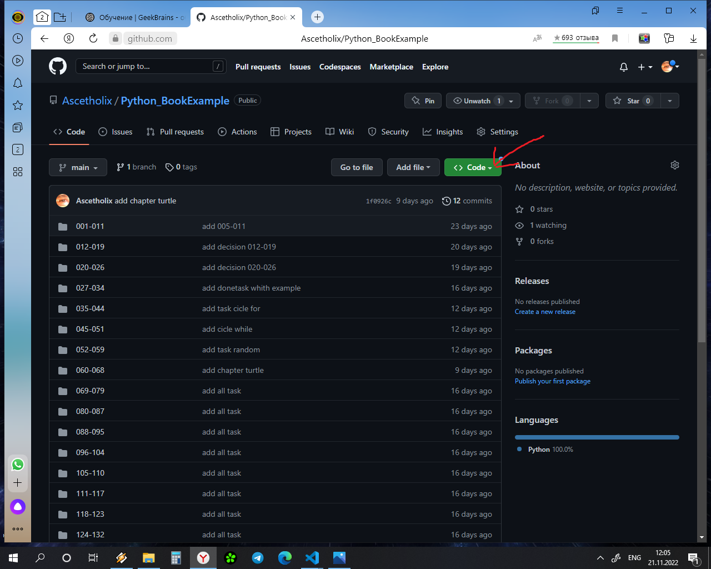
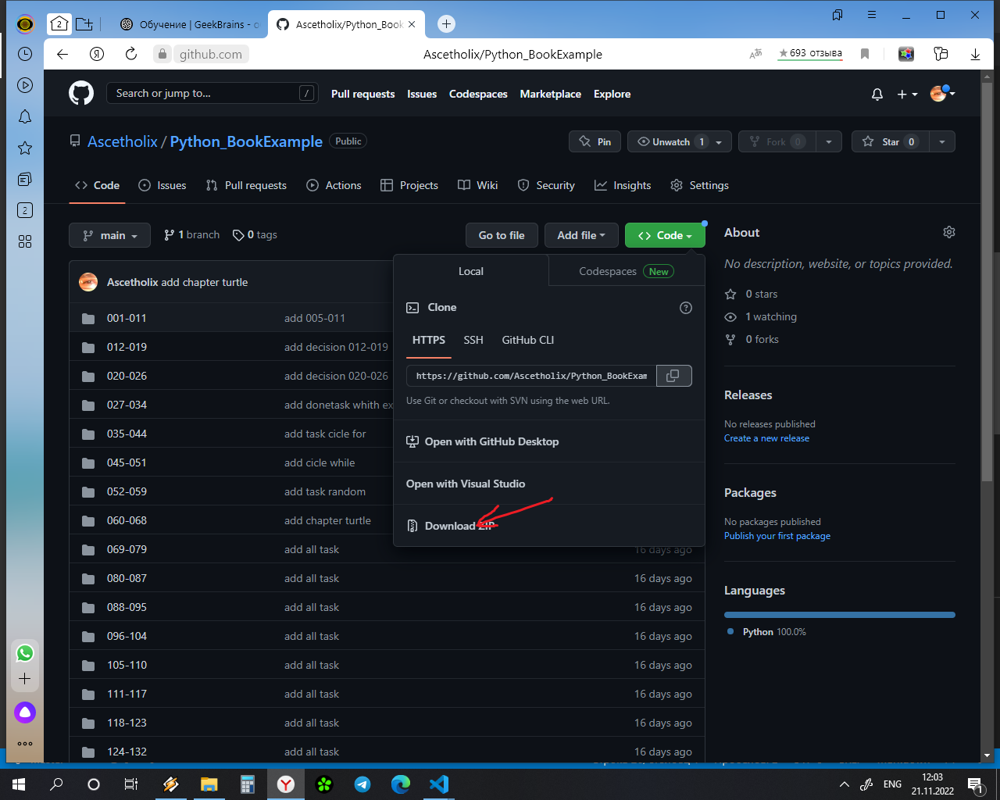
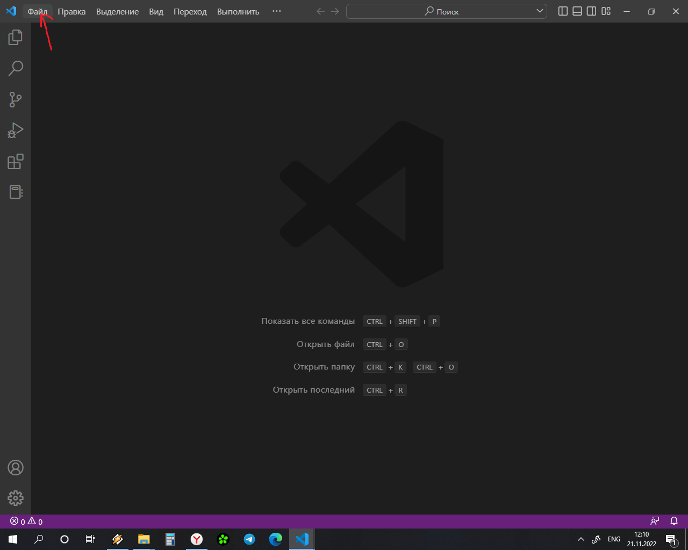
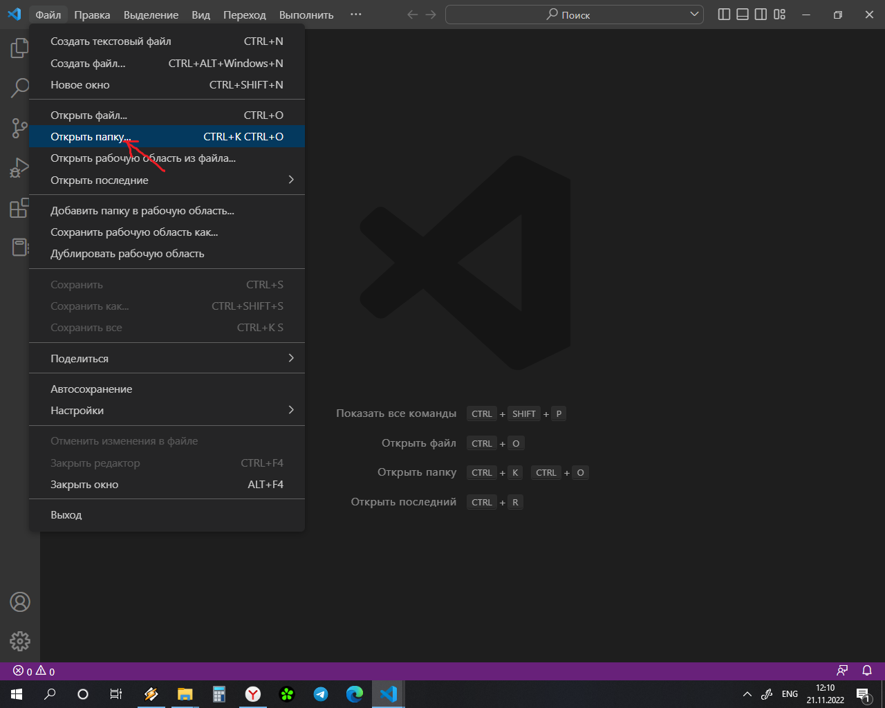
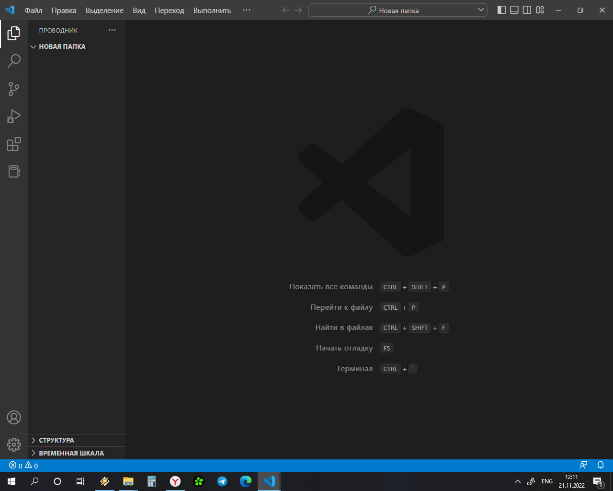
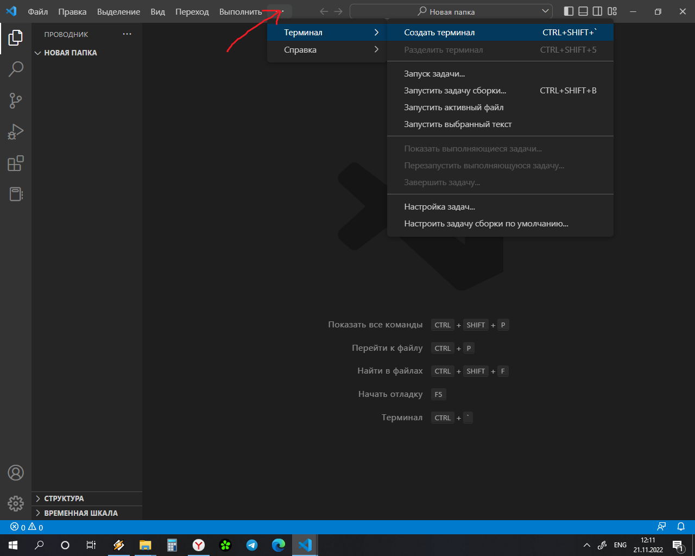
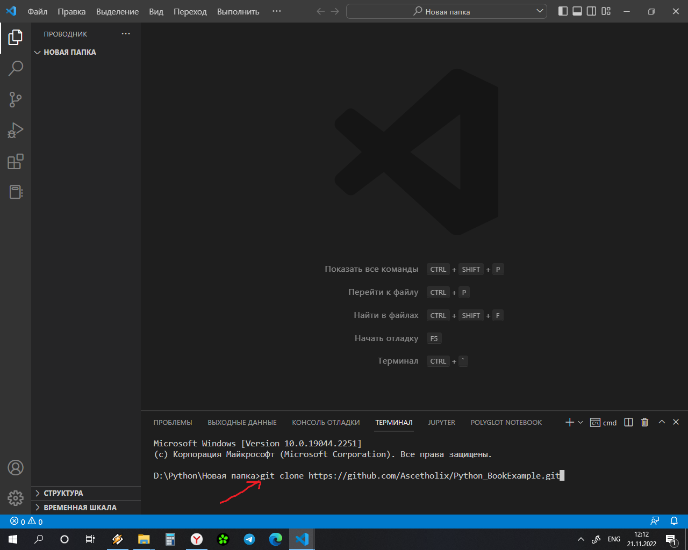
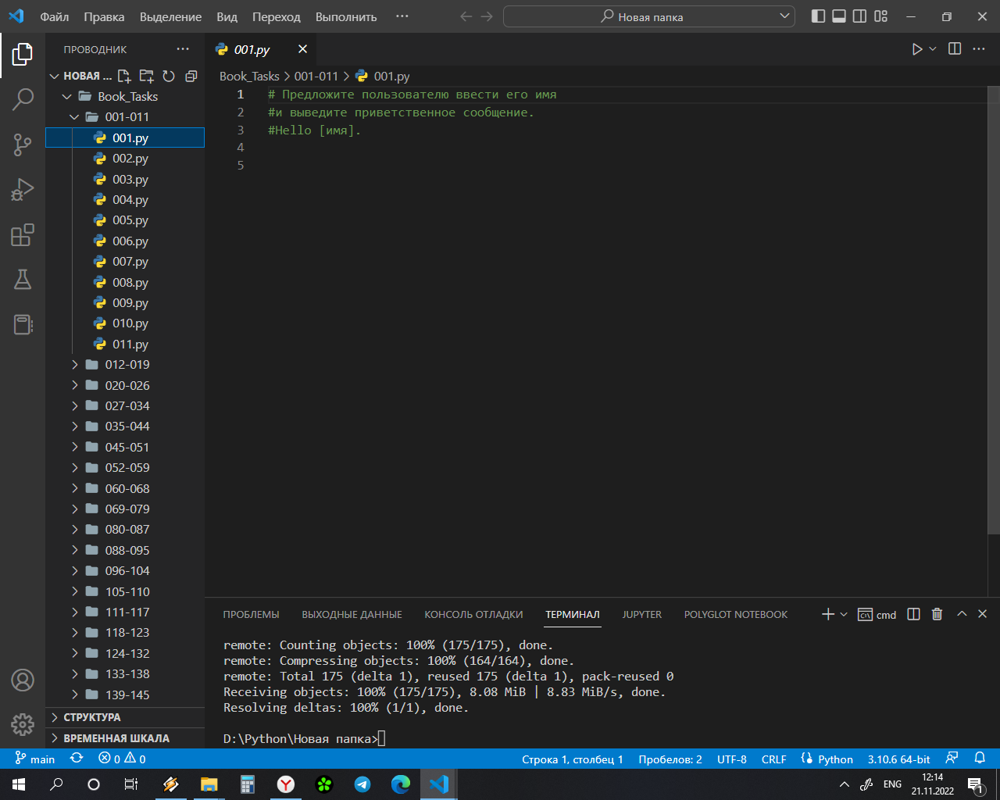

### ИНСТРУКЦИЯ ПО ПОЛЬЗОВАНИЮ
___

## Скачать архив
 
Скачать

___

## Для работы в Visual Studio Code

Скопировать ссылку

Открываем Visual Studio Code. Файл -> Открыт папку. Создать папку.

Вебераем в пункте меню Терминал -> Создат Терминал

В терминале набираем git clone *ссылка* (надо предварительно устоновить git)

Все решаем :smiley:

